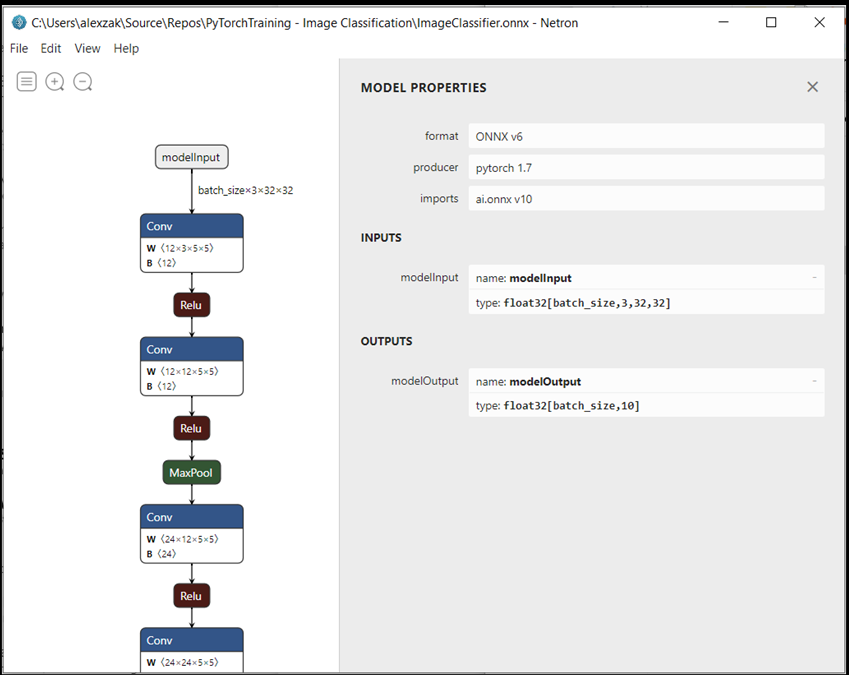

# Convert your PyTorch model to ONNX 

In the [previous stage of this tutorial](pytorch-train-model.md), we used PyTorch to create our machine learning model. However, that model is a `.pth` file. To be able to integrate it with Windows ML app, you'll need to convert the model to ONNX format. 

## Export the model

To export a model, you will use the `torch.onnx.export()` function. This function executes the model, and records a trace of what operators are used to compute the outputs.  

1. Copy the following code into the `PyTorchTraining.py` file in Visual Studio, above your main function.

```py
import torch.onnx 

#Function to Convert to ONNX 
def Convert_ONNX(): 

    # set the model to inference mode 
    model.eval() 

    # Let's create a dummy input tensor  
    dummy_input = torch.randn(1, input_size, requires_grad=True)  

    # Export the model   
    torch.onnx.export(model,         # model being run 
         dummy_input,       # model input (or a tuple for multiple inputs) 
         "ImageClassifier.onnx",       # where to save the model  
         export_params=True,  # store the trained parameter weights inside the model file 
         opset_version=10,    # the ONNX version to export the model to 
         do_constant_folding=True,  # whether to execute constant folding for optimization 
         input_names = ['modelInput'],   # the model's input names 
         output_names = ['modelOutput'], # the model's output names 
         dynamic_axes={'modelInput' : {0 : 'batch_size'},    # variable length axes 
                                'modelOutput' : {0 : 'batch_size'}}) 
    print(" ") 
    print('Model has been converted to ONNX') 
```

It's important to call `model.eval()` or `model.train(False)` before exporting the model, as this sets the model to **inference mode**. This is needed since operators like `dropout` or `batchnorm` behave differently in inference and training mode. 


2. To run the conversion to ONNX, add a call to the conversion function to the main function. You don't need to train the model again, so we'll comment out some functions that we no longer need to run. Your main function will be as follows.


```py
if __name__ == "__main__": 

    # Let's build our model 
    #train(5) 
    #print('Finished Training') 

    # Test which classes performed well 
    #testAccuracy() 

    # Let's load the model we just created and test the accuracy per label 
    model = Network() 
    path = "myFirstModel.pth" 
    model.load_state_dict(torch.load(path)) 

    # Test with batch of images 
    #testBatch() 
    # Test how the classes performed 
    #testClassess() 
 
    # Conversion to ONNX 
    Convert_ONNX() 
```

3. Run the project again by selecting the `Start Debugging` button on the toolbar, or pressing `F5`. There's no need to train the model again, just load the existing model from the project folder.  

The output will be as follows.


Navigate to your project location and find the ONNX model next to the `.pth` model. 

> [!NOTE]
> Interested in learning more? Review the [PyTorch tutorial on exporting a model](https://pytorch.org/tutorials/advanced/super_resolution_with_onnxruntime.html). 

## Explore your model. 

1. Open the `ImageClassifier.onnx` model file with Netron. 

2. Select the *data* node to open the model properties. 



As you can see, the model requires a 32-bit tensor (multi-dimensional array) float object as an input, and returns a Tensor float as an output. The output array will include the probability for every label. The way you built the model, the labels are represented by 10 numbers, and every number represents the ten classes of objects. 

| | | | | | | | | | |
| -- | -- | -- | -- | -- | -- | -- | -- | -- | -- |
| 0 | 1 | 2 | 3 | 4 | 5 | 6 | 7 | 8 | 9 |
| plane | car | bird | cat | deer | dog | frog | horse | ship | truck |

You'll need to extract these values to show the correct prediction with Windows ML app.

## Next Steps

Our model is ready to deploy. Next, for the main event - let's [build a Windows application and run it locally on your Windows device](pytorch-deploy-model.md).
