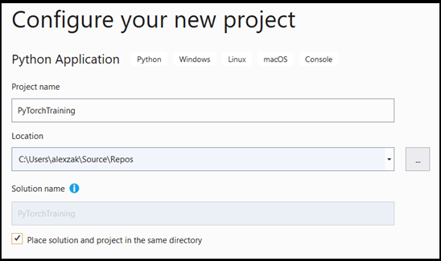
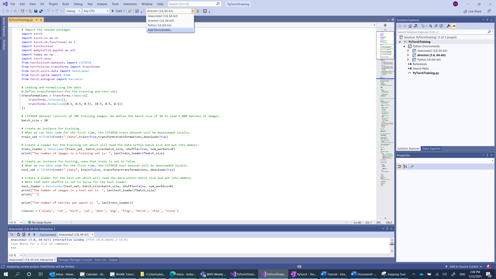
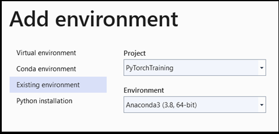

# Prepare the data 

In the [previous stage of this tutorial](pytorch-installation.md), we installed PyTorch on your machine. Now, we'll use it to set up our code with the data we'll use to make our model.

## Open a new project within Visual Studio. 

1. Open Visual Studio and choose `create a new project`. 


2. In the search bar, type `Python` and select `Python Application `as your project template. 


3. In the configuration window: 

* Name your project. Here, we call it **PyTorchTraining**.
* Choose the location of your project.  
* If you're using VS2019, ensure `Create directory for solution` is checked. 
* If you're suing VS 2017, ensure `Place solution and project in the same directory` is unchecked.



Press `create` to create your project.

## Create a Python interpreter  

Now, you need to define a new Python interpreter. This must include the PyTorch package you've recently installed.  

1. Navigate to interpreter selection, and select `Add environment`: 



2. In the `Add environment` window, select `Existing environment`, and choose `Anaconda3 (3.6, 64-bit)`. This includes the PyTorch package. 



To test the new Python interpreter and PyTorch package, enter the following code to the `PyTorchTraining.py` file: 

```
from __future__ import print_function 

import torch 

x=torch.rand(2, 3) 

print(x) 
```

The output should be a random 5x3 tensor similar to the below.


> [!NOTE]
> Interested in learning more? Visit the [PyTorch official website](https://pytorch.org/).

## Load the dataset

You'll use the PyTorch `torchvision` class to load the data.  

The Torchvision library includes several popular datasets such as Imagenet, CIFAR10, MNIST, etc, model architectures, and common image transformations for computer vision. That makes data loading in Pytorch quite an easy process. 

### CIFAR10

Here, we'll use the CIFAR10 dataset to build and train the image classification model.  CIFAR10 is a widely used dataset for machine learning research. It consists of 50,000 training images and 10,000 test images. All of them are of size 3x32x32, which means 3-channel color images of 32x32 pixels in size.  

The images are divided to 10 classes: ‘airplane’ (0), ‘automobile’ (1), ‘bird’ (2), ‘cat’ (3) , ‘deer’ (4), ‘dog’ (5), ‘frog’ (6), ‘horse’ (7), ‘ship’ (8), ‘truck’ (9).  

You will follow three steps to load and read the CIFAR10 dataset in PyTorch:  

* Define transformations to be applied to the image: To train the model, you need to transform the images to Tensors of normalized range [-1,1].  
* Create an instance of the available dataset and load the dataset: To load the data, you'll use the `torch.utils.data.Dataset` class - an abstract class for representing a dataset. The dataset will be downloaded locally only the first time you run the code.  
* Access the data using the DataLoader.  To get the access to the data and put the data into memory, you'll use the `torch.utils.data.DataLoader` class. DataLoader in Pytorch wraps a dataset and provides access to the underlying data. This wrapper will hold batches of images per defined batch size.

You'll repeat these three steps for both training and testing sets.  

1. Open the `PyTorchTraining.py file` in Visual Studio, and add the following code. This handles the three above steps for the training and test data sets from the CIFAR10 dataset. 

 
```py
from torchvision.datasets import CIFAR10
from torchvision.transforms import transforms
from torch.utils.data import DataLoader

# Loading and normalizing the data.
# Define transformations for the training and test sets
transformations = transforms.Compose([
    transforms.ToTensor(),
    transforms.Normalize((0.5, 0.5, 0.5), (0.5, 0.5, 0.5))
])

# CIFAR10 dataset consists of 50K training images. We define the batch size of 10 to load 5,000 batches of images.
batch_size = 10
number_of_labels = 10 

# Create an instance for training. 
# When we run this code for the first time, the CIFAR10 train dataset will be downloaded locally. 
train_set =CIFAR10(root="./data",train=True,transform=transformations,download=True)

# Create a loader for the training set which will read the data within batch size and put into memory.
train_loader = DataLoader(train_set, batch_size=batch_size, shuffle=True, num_workers=0)
print("The number of images in a training set is: ", len(train_loader)*batch_size)

# Create an instance for testing, note that train is set to False.
# When we run this code for the first time, the CIFAR10 test dataset will be downloaded locally. 
test_set = CIFAR10(root="./data", train=False, transform=transformations, download=True)

# Create a loader for the test set which will read the data within batch size and put into memory. 
# Note that each shuffle is set to false for the test loader.
test_loader = DataLoader(test_set, batch_size=batch_size, shuffle=False, num_workers=0)
print("The number of images in a test set is: ", len(test_loader)*batch_size)

print("The number of batches per epoch is: ", len(train_loader))
classes = ('plane', 'car', 'bird', 'cat', 'deer', 'dog', 'frog', 'horse', 'ship', 'truck')
```

The first time you run this code, the CIFAR10 dataset will be downloaded to your device. 


## Next Steps

With the data ready to go, it's time to [train our PyTorch model](pytorch-train-model.md)
