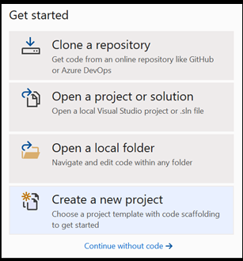
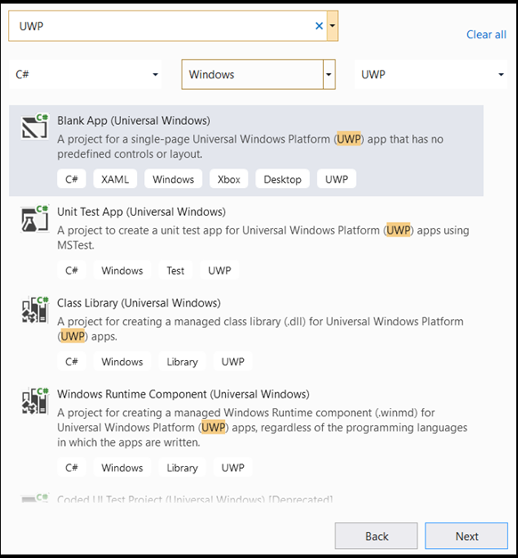
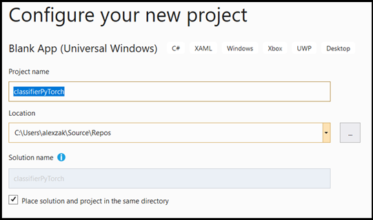
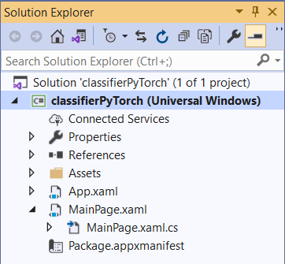
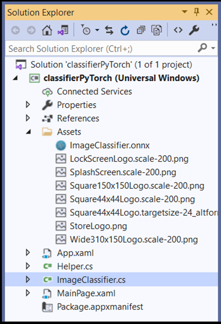
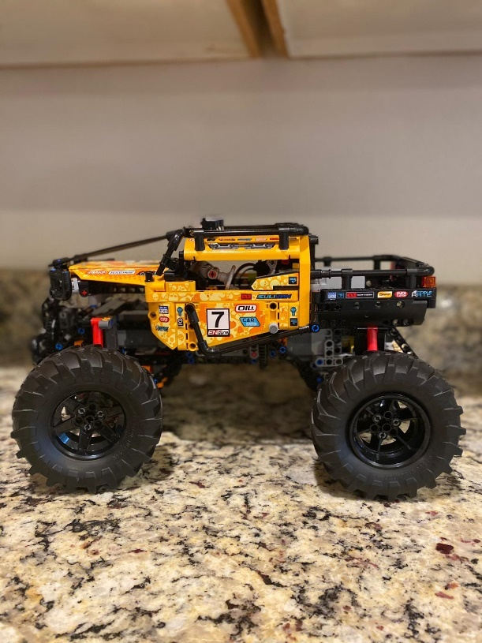
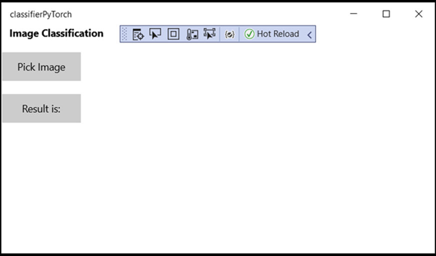

# Deploy model in Windows app with Windows ML API 

[In the previous part of this tutorial](pytorch-convert-model.md), you learned how to build and export a model in ONNX format. Now, we'll show you how to embed your exported model into a Windows application, and run it locally on a device by calling WinML APIs.  

By the time we're done, you'll have a working image classification app.

## About the sample app 

In this step of the tutorial, you'll create an app that can classify images using your ML model. Its basic UI allows you to select an image from your local device, and uses the classification ONNX model you built and trained in the previous part to classify it. The tags returned by the model are then displayed next to the image. 

Here, we'll walk you through that process.

> [!NOTE]
> If you choose to use the predefined code sample, you can clone [the solution file](https://github.com/microsoft/Windows-Machine-Learning/tree/master/Samples/Tutorial%20Samples/PyTorch%20Image%20Classification/Windows%20ML%20code%20-%20classifierPyTorchModel). Clone the repository, navigate to this sample, and open the `classifierPyTorch.sln` file with Visual Studio.Skip to the **Launch the Application** part of this page to see it in use.

Below, we'll guide you how to create your app and add Windows ML code.  

## Create a Windows ML UWP (C#)  

To make a working Windows ML app, you'll need to do the following:

* Load a machine learning model. 
* Load an image in a required format.
* Bind the model's inputs and outputs. 
* Evaluate the model and display meaningful results. 

You'll also need to create a basic UI, as it's hard to create a satisfactory image-based app in the command line.

### Open a new project within Visual Studio 

1. Let's get started. Open Visual Studio and choose **create a new project**.



2. In the search bar, type `UWP`, then select `Blank APP (Universal Windows)`. This opens a C# project for a single-page Universal Windows Platform (UWP) app with predefined controls or layout. Select `next` to open a configuration window for the project.  



3. In the configuration window, do the following:

* Name your project. Here, we call it **classifierPyTorch**.
* Choose the location of your project.  
* If you're using VS2019, ensure `Create directory for solution` is checked. 
* If you're using VS2017, ensure `Place solution and project in the same directory` is unchecked.



Press `create` to create your project. The minimum target version window may pop up. Be sure your minimum version is set to **Windows 10, version 1809 (10.0; build 17763)** or higher.

4. After the project is created, navigate to the project folder, open the **assets** folder `[….\classifierPyTorch \Assets]`, and copy your `ImageClassifier.onnx` file to this location.  

### Explore project solution 

Let's explore your project solution.

Visual Studio automatically created several cs-code files inside the Solution Explorer. `MainPage.xaml` contains the XAML code for your GUI, and `MainPage.xaml.cs` contains your application code, also known as the code-behind. If you've created a UWP app before, these files should be very familiar to you.



## Create the Application GUI  

First, let's create a simple GUI for your app. 

1. Double-click on the `MainPage.xaml` code file. In your blank app, the XAML template for your app's GUI is empty, so we'll need to add some UI features.

2. Add the below code to `MainPage.xaml`, replacing the `<Grid>` and `</Grid>` tags.  

```xaml
    <Grid Background="{ThemeResource ApplicationPageBackgroundThemeBrush}"> 

        <StackPanel Margin="1,0,-1,0"> 
            <TextBlock x:Name="Menu"  
                       FontWeight="Bold"  
                       TextWrapping="Wrap" 
                       Margin="10,0,0,0" 
                       Text="Image Classification"/> 
            <TextBlock Name="space" /> 
            <Button Name="recognizeButton" 
                    Content="Pick Image" 
                    Click="OpenFileButton_Click"  
                    Width="110" 
                    Height="40" 
                    IsEnabled="True"  
                    HorizontalAlignment="Left"/> 
            <TextBlock Name="space3" /> 
            <Button Name="Output" 
                    Content="Result is:" 
                    Width="110" 
                    Height="40" 
                    IsEnabled="True"  
                    HorizontalAlignment="Left"  
                    VerticalAlignment="Top"> 
            </Button> 
            <!--Display the Result--> 
            <TextBlock Name="displayOutput"  
                       FontWeight="Bold"  
                       TextWrapping="Wrap" 
                       Margin="25,0,0,0" 
                       Text="" Width="1471" /> 
            <TextBlock Name="space2" /> 
            <!--Image preview --> 
            <Image Name="UIPreviewImage" Stretch="Uniform" MaxWidth="300" MaxHeight="300"/> 
        </StackPanel> 
    </Grid> 
```

## Add the model to the project using Windows ML Code Generator (mlgen) 

Windows Machine Learning Code Generator, or **mlgen**, is a Visual Studio extension to help you get started using WinML APIs on UWP apps. It generates template code when you add a trained ONNX file into the UWP project. 

Windows Machine Learning's code generator mlgen creates an interface (for C#, C++/WinRT, and C++/CX) with wrapper classes that call the Windows ML API for you. This allows you to easily load, bind, and evaluate a model in your project. We'll use it in this tutorial to handle many of those functions for us.

Code generator is available for Visual Studio 2017 and later. We recommend using Visual Studio. Please be aware that in Windows 10, version 1903 and later, mlgen is no longer included in the Windows 10 SDK, so you must download and install the extension. If you've been following this tutorial from the introduction, you will have already handled this, but if not, you should download for [VS 2019](https://marketplace.visualstudio.com/items?itemName=WinML.mlgenv2) or for [VS 2017](https://marketplace.visualstudio.com/items?itemName=WinML.mlgen).

> [!NOTE]
> To learn more about mlgen, please see the [mlgen documentation](../mlgen.md)

1. If you haven't already, install mlgen.

2. Right-click on the `Assets` folder in the Solution Explorer in Visual studio, and select `Add > Existing Item`. 

3. Navigate to the assets folder inside `classifierPyTorch [….\classifierPyTorch \Assets]`, find the ONNX model you previously copied there, and select `add`.

4. After you added an ONNX model to the assets folder in solution explorer in VS, the project should now have two new files: 
*   `ImageClassifier.onnx`  - this is your model in ONNX format.
*   `ImageClassifier.cs` – automatically generated WinML code file. 



5. To make sure the model builds when you compile our application, select the `ImageClassifier.onnx` file and choose `Properties`. For `Build Action`, select `Content`.

### ONNX file code

Now, let’s explore a newly generated code in the `ImageClassifier.cs` file.  

The generated code includes three classes: 

* `ImageClassifierModel`: This class includes two methods for model instantiation and model evaluation. It will help us to create the machine learning model representation, create a session on the system default device, bind the specific inputs and outputs to the model, and evaluate the model asynchronously. 
* `ImageClassifierInput`: This class initializes the input types that the model expects. The model input depends on the model requirements for input data.
* `ImageClassifierOutput`: This class initializes the types that the model will output. The model output depends on how it is defined by the model.


In this tutorial, we don't want to deal with tensorization. We'll make a slight change to the `ImageClassifierInput` class, to change the input data type and make our life easier.

1. Make the following changes in the `ImageClassifier.cs` file:  

Change the `input` variable from a `TensorFloat` to an `ImageFeatureValue`.

```csharp
public sealed class ImageClassifierInput 
    { 
        public ImageFeatureValue input; // shape(-1,3,32,32) 
    } 
```
 
### Load the Model 

1. Double-click on the `MainPage.xaml.cs` file to open the code-behind for the app.

2. Replace the “using” statements by following, to get an access to all the APIs that you'll need: 

```csharp
// Specify all the using statements which give us the access to all the APIs that we'll need 
using System; 
using System.Threading.Tasks; 
using Windows.AI.MachineLearning; 
using Windows.Graphics.Imaging; 
using Windows.Media; 
using Windows.Storage; 
using Windows.Storage.Pickers; 
using Windows.Storage.Streams; 
using Windows.UI.Xaml; 
using Windows.UI.Xaml.Controls; 
using Windows.UI.Xaml.Media.Imaging; 
```

3. Add the following variable declarations inside your `MainPage` class, above the `public MainPage()` function.

```csharp
        // All the required fields declaration 
        private ImageClassifierModel modelGen; 
        private ImageClassifierInput image = new ONNXInput(); 
        private ImageClassifierOutput results; 
        private StorageFile selectedStorageFile; 
        private string label = ""; 
        private float probability = 0; 
        private Helper helper = new Helper(); 

        public enum Labels 
        {             
            plane,
            car,
            bird,
            cat,
            deer,
            dog,
            frog,
            horse,
            ship,
            truck
        } 
```

Now, you'll implement the `LoadModel` method. The method will access the ONNX model and store it in memory. Then, you'll use the `CreateFromStreamAsync` method to instantiate the model as a `LearningModel` object. The `LearningModel` class represents a trained machine learning model. Once instantiated, the `LearningModel` is the initial object you use to interact with Windows ML. 

To load the model, you can use several static methods in the `LearningModel` class. In this case, you'll use the `CreateFromStreamAsync` method. 

The `CreateFromStreamAsync` method was automatically created with mlgen, so you don't need to implement this method. You can review this method by double clicking on the `classifier.cs` file generated file by mlgen.

> [!NOTE]
> To learn more about `LearningModel` class, please review the [LearningModel Class documentation](/uwp/api/windows.ai.machinelearning.learningmodel?preserve-view=true&view=winrt-19041). To learn more about additional ways of loading the model, please review the [Load a model documentation](../load-a-model.md)
 
4. Add a call to a `loadModel` method to the constructor of the main class. 

```csharp
        // The main page to initialize and execute the model.
        public MainPage()
        {
            this.InitializeComponent();
            loadModel();
        }
```

5. Add the implementation of the `loadModel` method, inside that `MainPage` class.

```csharp
        private async Task loadModel()
        {
            // Get an access the ONNX model and save it in memory.
            StorageFile modelFile = await StorageFile.GetFileFromApplicationUriAsync(new Uri($"ms-appx:///Assets/ImageClassifier.onnx"));
            // Instantiate the model. 
            modelGen = await ImageClassifierModel.CreateFromStreamAsync(modelFile);
        }
```

### Load the Image 

1. We need to define a click event to initiate the sequence of four method calls for model execution – conversion, binding and evaluation, output extraction and display the results. Add the following method to your `MainPage.xaml.cs` code file inside the `MainPage` class.

```csharp
        // Waiting for a click event to select a file 
        private async void OpenFileButton_Click(object sender, RoutedEventArgs e)
        {
            if (!await getImage())
            {
                return;
            }
            // After the click event happened and an input selected, begin the model execution. 
            // Bind the model input
            await imageBind();
            // Model evaluation
            await evaluate();
            // Extract the results
            extractResult();
            // Display the results  
            await displayResult();
        }
```

2. Now, you'll implement the `getImage()` method. This method will select an input image file and save it in memory. Add the following method to your `MainPage.xaml.cs` code file inside the `MainPage` class.

```csharp
        // A method to select an input image file
        private async Task<bool> getImage()
        {
            try
            {
                // Trigger file picker to select an image file
                FileOpenPicker fileOpenPicker = new FileOpenPicker();
                fileOpenPicker.SuggestedStartLocation = PickerLocationId.PicturesLibrary;
                fileOpenPicker.FileTypeFilter.Add(".jpg");
                fileOpenPicker.FileTypeFilter.Add(".png");
                fileOpenPicker.ViewMode = PickerViewMode.Thumbnail;
                selectedStorageFile = await fileOpenPicker.PickSingleFileAsync();
                if (selectedStorageFile == null)
                {
                    return false;
                }
            }
            catch (Exception)
            {
                return false;
            }
            return true;
        }
```

Next, you will implement an image `Bind()` method to get the representation of the file in the bitmap BGRA8 format. But first, you'll create a helper class to resize the image.  

3. To create a helper file, right-click on the solution name (`ClassifierPyTorch`), then choose `Add a new item`. In the open window, select `Class` and give it a name. Here, we're calling it `Helper`.  


4. A new class file will appear within your project. Open this class, and add the following code:
 
```csharp
using System; 
using System.Threading.Tasks; 
using Windows.Graphics.Imaging; 
using Windows.Media; 

namespace classifierPyTorch 
{ 
    public class Helper 
    { 
        private const int SIZE = 32;  
        VideoFrame cropped_vf = null; 
 
        public async Task<VideoFrame> CropAndDisplayInputImageAsync(VideoFrame inputVideoFrame) 
        { 
            bool useDX = inputVideoFrame.SoftwareBitmap == null; 

            BitmapBounds cropBounds = new BitmapBounds(); 
            uint h = SIZE; 
            uint w = SIZE; 
            var frameHeight = useDX ? inputVideoFrame.Direct3DSurface.Description.Height : inputVideoFrame.SoftwareBitmap.PixelHeight; 
            var frameWidth = useDX ? inputVideoFrame.Direct3DSurface.Description.Width : inputVideoFrame.SoftwareBitmap.PixelWidth; 
 
            var requiredAR = ((float)SIZE / SIZE); 
            w = Math.Min((uint)(requiredAR * frameHeight), (uint)frameWidth); 
            h = Math.Min((uint)(frameWidth / requiredAR), (uint)frameHeight); 
            cropBounds.X = (uint)((frameWidth - w) / 2); 
            cropBounds.Y = 0; 
            cropBounds.Width = w; 
            cropBounds.Height = h; 
 
            cropped_vf = new VideoFrame(BitmapPixelFormat.Bgra8, SIZE, SIZE, BitmapAlphaMode.Ignore); 
 
            await inputVideoFrame.CopyToAsync(cropped_vf, cropBounds, null); 
            return cropped_vf; 
        } 
    } 
} 
```

Now, let's convert the image to the appropriate format.

The `ImageClassifierInput` class initializes the input types that the model expects. In our case, we configured our code to expect an `ImageFeatureValue`.

The `ImageFeatureValue` class describes the properties of the image used to pass into a model. To create an `ImageFeatureValue`, you use `CreateFromVideoFrame` method. For more specific details of why this is the case and how these classes and methods work, see the [ImageFeatureValue class documentation](/uwp/api/windows.ai.machinelearning.imagefeaturevalue?view=winrt-19041)

> [!NOTE]
> In this tutorial, we use the `ImageFeatureValue` class instead of a tensor. If Window ML does not support your model’s color format, this won't be an option. For an example of how to work with image conversions and tensorization, see the [Custom Tensorization Sample](https://github.com/Microsoft/Windows-Machine-Learning/tree/master/Samples/CustomTensorization).

5. Add the implementation of the `convert()` method to your `MainPage.xaml.cs` code file inside the MainPage class. The convert method will get us a representation of the input file in a BGRA8 format.

```csharp
// A method to convert and bide the input image. 
private async Task imageBind () 
{
    UIPreviewImage.Source = null; 
    try
    { 
        SoftwareBitmap softwareBitmap;
        using (IRandomAccessStream stream = await selectedStorageFile.OpenAsync(FileAccessMode.Read)) 
        {
            // Create the decoder from the stream
            BitmapDecoder decoder = await BitmapDecoder.CreateAsync(stream);
            // Get the SoftwareBitmap representation of the file in BGRA8 format
            softwareBitmap = await decoder.GetSoftwareBitmapAsync();
            softwareBitmap = SoftwareBitmap.Convert(softwareBitmap, BitmapPixelFormat.Bgra8, BitmapAlphaMode.Premultiplied);
        }
        // Display the image 
        SoftwareBitmapSource imageSource = new SoftwareBitmapSource();
        await imageSource.SetBitmapAsync(softwareBitmap);
        UIPreviewImage.Source = imageSource;

        // Encapsulate the image within a VideoFrame to be bound and evaluated
        VideoFrame inputImage = VideoFrame.CreateWithSoftwareBitmap(softwareBitmap);
        // Resize the image size to 32x32  
        inputImage=await helper.CropAndDisplayInputImageAsync(inputImage); 
        // Bind the model input with image 
        ImageFeatureValue imageTensor = ImageFeatureValue.CreateFromVideoFrame(inputImage); 
        image.modelInput = imageTensor; 

        // Encapsulate the image within a VideoFrame to be bound and evaluated
        VideoFrame inputImage = VideoFrame.CreateWithSoftwareBitmap(softwareBitmap); 
        // bind the input image 
        ImageFeatureValue imageTensor = ImageFeatureValue.CreateFromVideoFrame(inputImage); 
        image.modelInput = imageTensor; 
    }
    catch (Exception e) 
    {
    }
} 
```

## Bind and Evaluate the model

Next, you'll create a session based on the model, bind the input and output from the session, and evaluate the model.

### Create a session to bind the model:

To create a session, you use the `LearningModelSession` class. This class is used to evaluate machine learning models, and binds the model to a device that then runs and evaluates the model.  You can select a device when you create a session to execute your model on a specific device of your machine. The default device is the CPU.

> [!NOTE]
> To learn more about how to choose a device, please review the [Create a session](../create-a-session.md) documentation.

### Bind model inputs and outputs:

To bind input and output, you use the `LearningModelBinding` class. A machine learning model has input and output features, which pass information into and out of the model. Be aware that required features must be supported by the Window ML APIs. The `LearningModelBinding` class is applied on a `LearningModelSession` to bind values to named input and output features.

The implementation of the binding is automatically generated by mlgen, so you don’t have to take care of it. The binding is implemented by calling the predefined methods of the `LearningModelBinding` class. In our case, it uses the `Bind` method to bind a value to the named feature type.

### Evaluate the model:

After you create a session to bind the model and bounded values to a model’s inputs and outputs, you can evaluate the model’s inputs and get its predictions. To run the model execution, you should call any of the predefined evaluate methods on the LearningModelSession. In our case, we'll use the `EvaluateAsync` method.
 
Similar to `CreateFromStreamAsync`, the `EvaluateAsync` method was also automatically generated by WinML Code Generator, so you don’t need to implement this method. You can review this method in the `ImageClassifier.cs` file.

The `EvaluateAsync` method will asynchronously evaluate the machine learning model using the feature values already bound in bindings. It will create a session with `LearningModelSession`, bind the input and output with `LearningModelBinding`, execute the model evaluation, and get the output features of the model using the `LearningModelEvaluationResult` class.

> [!NOTE]
> To learn about another evaluate methods to run the model, please check which methods can be implemented on the LearningModelSession by reviewing the [LearningModelSession Class documentation](/uwp/api/windows.ai.machinelearning.learningmodelsession?preserve-view=true&view=winrt-19041). 

1. Add the following method to your `MainPage.xaml.cs` code file inside the MainPage class to create a session, bind and evaluate the model.

```csharp
        // A method to evaluate the model
        private async Task evaluate()
        {
            results = await modelGen.EvaluateAsync(image);
        }
```

## Extract and display the results

You'll now need to extract the model output and display the right result, which you'll do by implementing the `extractResult` and `displayResult` methods. You'll need to find the highest probability to return the correct label. 

1. Add the `extractResult` method to your `MainPage.xaml.cs` code file inside the `MainPage` class.

```csharp
        // A method to extract output from the model 
        private void extractResult()
        {
            // Retrieve the results of evaluation
            var mResult = results.modelOutput as TensorFloat;
            // convert the result to vector format
            var resultVector = mResult.GetAsVectorView();
            
            probability = 0;
            int index = 0;
            // find the maximum probability
            for(int i=0; i<resultVector.Count; i++)
            {
                var elementProbability=resultVector[i];
                if (elementProbability > probability)
                {
                    index = i;
                }
            }
            label = ((Labels)index).ToString();
        }
```

2. Add the `displayResult` method to your `MainPage.xaml.cs` code file inside the `MainPage` class.

```csharp
        private async Task displayResult() 
        {
            displayOutput.Text = label; 
        }
``` 

That’s it! You've successfully created the Windows machine learning app with a basic GUI to test our classification model. The next step is to launch the application and run it locally on your Windows device.  

## Launch the application 

Once you completed the application interface, added the model, and generated the Windows ML code, you can test the application!  

Enable developer mode and test your application from Visual Studio. Make sure the dropdown menus in the top toolbar are set to `Debug`. Change the Solution Platform to x64 to run the project on your local machine if your device is 64-bit, or x86 if it's 32-bit. 

Our model was trained to classify the following images: plane, car, bird, cat, deer, dog, frog, horse, ship, truck. To test our app, you will use the image of the Lego car built for this project. Let’s see how our app classifies the content of the image.  



1. Save this image on your local device to test the app. Change the image format to `.jpg` if required. You can also any other relevant image from your local device in a .jpg or .png format. 

2. To run the project, select the `Start Debugging` button on the toolbar, or press `F5`. 

3. When the application starts, press Pick Image and select the image from your local device.  



The result will appear on the screen right away. As you can see, our Windows ML app successfully classified the image as a car. 


### Summary

You've just made your first Windows Machine Learning app, from model creation to successful execution.

### Additional Resources

To learn more about topics mentioned in this tutorial, visit the following resources:
*   Windows ML tools: Learn more tools like the [Windows ML Dashboard](../dashboard.md), [WinMLRunner](../winmlrunner.md), and the [mglen](../mlgen.md) Windows ML code generator. 
*   [ONNX model](../get-onnx-model.md): Learn more about the ONNX format.
*   [Windows ML performance and memory](../performance-memory.md): Learn more how to manage app performance with Windows ML. 
*   [Windows Machine Learning API reference](../api-reference.md): Learn more about three areas of Windows ML APIs.
